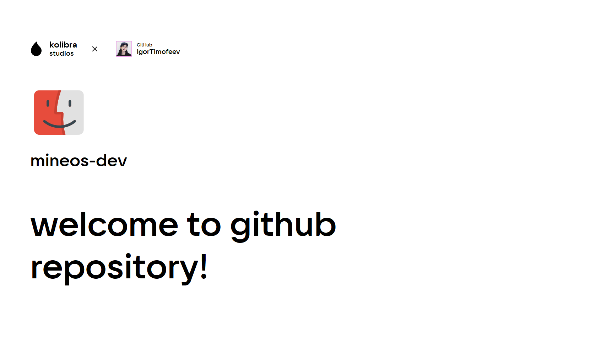

## mineOS Developer Preview

### Greeting

Welcome to the repository, friends! This repository is a modified version of mineOS, which has interesting features. This system is based on the mineCORE 3.0 kernel and is an interesting system. The system operates in the mode of graphical interface and terminal interface. You can enter the terminal either from: mineOS > Go to shell, or from the lock screen by clicking: Go to shell.
There are the same functions and features as in the usual mineOS, namely:

-   Multitasking
-   Double buffered graphical user interface
-   Language packs and software localization
-   Multiple user profiles with password authentication
-   Own EEPROM firmware with boot volume choose/format/rename features and Internet Recovery mode
-   File sharing over the local network via modems
-   Client connections to real FTP servers
-   An internal IDE with syntax highlighting and debugger
-   Integrated application and library App Market with the ability to publish your own scripts and programs for every MineOS user
-   Error reporting system with the possibility to send information to developers
-   Animations, wallpapers, screensavers, color schemes and huge customization possibilities
-   Open source system API and detailed illustrated documentations

As well as new ones:

-   Full terminal mode
-   MineOS Package Manager
-   Support for mineOS terminal programs
-   Support for OpenOS terminal programs

### Note

We do not recommend updating MineOS via App Marker, as the operation of this version will be disrupted! Until there is a full-fledged package manager, so install the necessary applications through the App Market, but we do not recommend updating the libraries and the system!

### Test version

If you have bugs or errors in the work of MineOS Developer Preview, we ask you to immediately notify about bugs and errors on GitHub.
